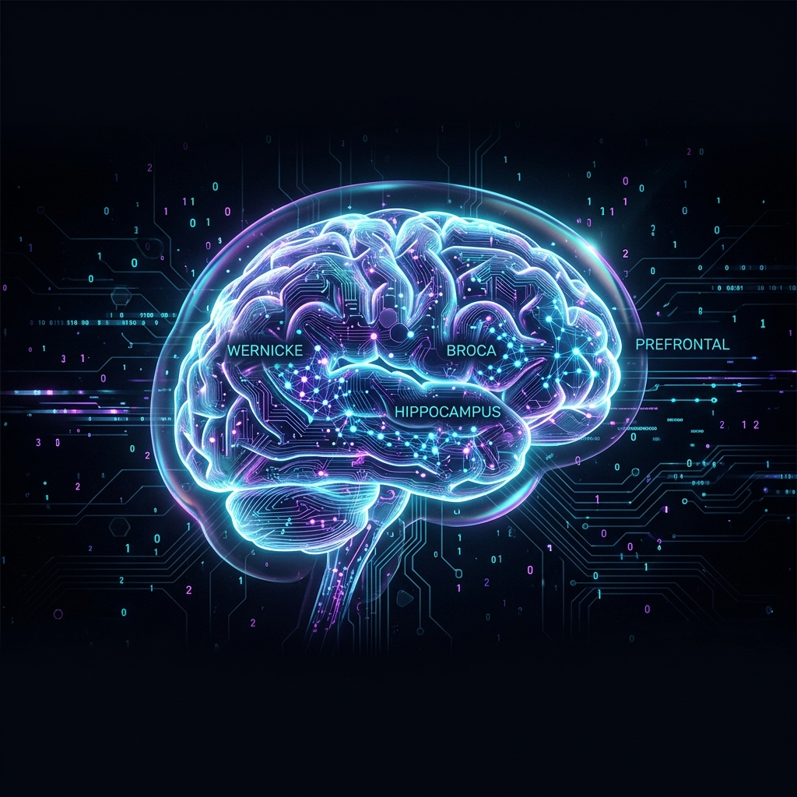
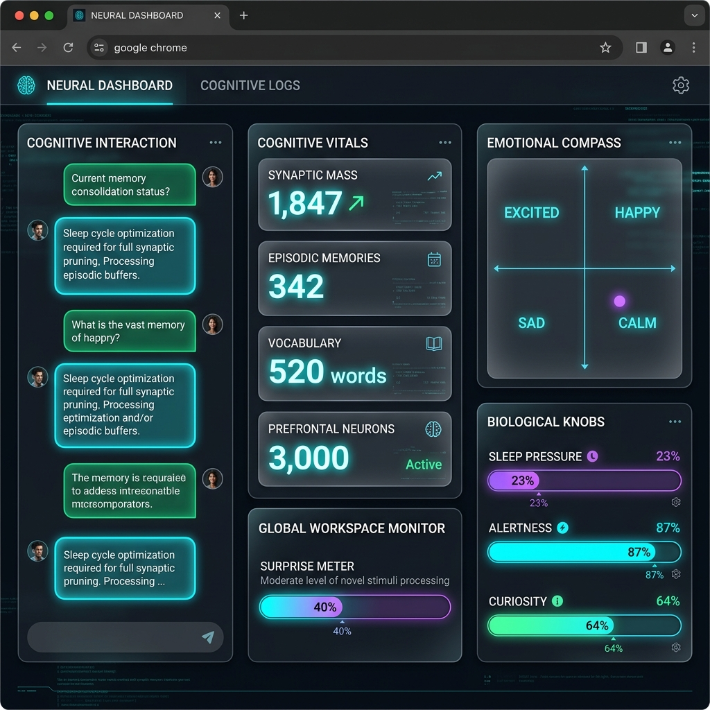

<p align="center">
  
</p>

<p align="center">
  
</p>

<h3 align="center">The world's first Organic Cognitive Model (OCM)</h3>
<h4 align="center">A new class of intelligence. Not an LLM. Not AGI. Something else entirely.</h4>

<p align="center"><i>"LLMs predict the next token. OCMs think."</i></p>

<p align="center">
  
  
  
  
  
  
  
  
</p>

<p align="center">
  <a href="#-the-problem-with-llms">Why Not LLMs</a> •
  <a href="#-what-is-an-ocm">What Is An OCM</a> •
  <a href="#-architecture">Architecture</a> •
  <a href="#-quick-start">Quick Start</a> •
  <a href="#-neural-dashboard">Dashboard</a> •
  <a href="#-benchmarks">Benchmarks</a> •
  <a href="#-roadmap">Roadmap</a>
</p>

---

## 🚨 The Problem With LLMs

Large Language Models are the horse carriages of AI. Impressive, expensive, and fundamentally limited:

- ❌ **They can't learn.** Training costs $100M+. After that, they're frozen.
- ❌ **They forget.** Fine-tune on new data → old knowledge disappears (catastrophic forgetting).
- ❌ **They hallucinate.** They don't know what they don't know. They guess confidently.
- ❌ **They waste compute.** Every token activates ALL parameters. 70B params × every word.
- ❌ **They have no memory.** Every conversation starts from zero.
- ❌ **They have no emotion.** Temperature slider ≠ intelligence.
- ❌ **They require datacenters.** 80GB VRAM minimum for a serious model.

The industry's answer? **Make them bigger.** More params. More data. More GPUs. More money.

Our answer? **Make them smarter.**

---

## 🧠 What Is An OCM?

An **Organic Cognitive Model** is a fundamentally new class of AI — inspired by the human brain, not by linear algebra.

```
LLM  = Large    Language   Model   → static • expensive • forgets • hallucinates
OCM  = Organic  Cognitive  Model   → living • free • remembers • knows its limits
```

Where an LLM is a **very expensive autocomplete**, an OCM is an **organism that thinks, learns, remembers, and grows.**

### The OCM Manifesto

| Principle | What It Means |
|-----------|---------------|
| 🧬 **Organic** | It grows. It adapts. It learns continuously without retraining. |
| 🧠 **Cognitive** | It doesn't just process language — it reasons, remembers, and feels. |
| 💤 **Sleep** | It consolidates memories like a biological brain. It never forgets. |
| 🔍 **Curiosity** | It knows what it doesn't know — and actively seeks to learn. |
| ⚡ **Sparse** | It activates only what it needs. 73.9× faster than dense compute. |
| 💻 **Local** | It runs on your laptop. No datacenter. No API key. No cost. |

> NexusCortex is the world's first OCM implementation.

---

## 🔬 How It Works

Nexus Cortex is a **complete cognitive engine** — modeled after the human brain's architecture — written entirely from scratch in Go with optional CUDA acceleration.

It doesn't call OpenAI. It doesn't wrap Hugging Face. It doesn't use PyTorch.

**It IS the model.**

```
Input → Wernicke (comprehension) → Hippocampus (memory) → Prefrontal (reasoning)
      → Expert Routing → Broca (language generation) → Emotion → Output
```

---

## 🧬 Architecture

```
╔══════════════════════════════════════════════════════════════╗
║                    NEXUS CORTEX ORGANISM                     ║
╠══════════════════════════════════════════════════════════════╣
║                                                              ║
║  ┌─────────────┐     ┌──────────────┐    ┌──────────────┐   ║
║  │  Wernicke    │────▶│ Hippocampus  │───▶│  Prefrontal  │   ║
║  │ (understand) │     │  (remember)  │    │   (reason)   │   ║
║  └──────┬───────┘     └──────────────┘    └──────┬───────┘   ║
║         │                                        │           ║
║  ┌──────▼───────┐     ┌──────────────┐    ┌──────▼───────┐   ║
║  │   Sensory    │     │   Emotion    │    │    Broca     │   ║
║  │  (encode)    │     │   (modulate) │    │  (generate)  │   ║
║  └──────────────┘     └──────────────┘    └──────────────┘   ║
║                                                              ║
║  ┌──────────────┐     ┌──────────────┐    ┌──────────────┐   ║
║  │  Cerebellum  │     │   Curiosity  │    │    Sleep     │   ║
║  │  (motor)     │     │   (explore)  │    │ (consolidate)│   ║
║  └──────────────┘     └──────────────┘    └──────────────┘   ║
║                                                              ║
║  ┌──────────────────────────────────────────────────────┐    ║
║  │            Fractal Cortex — Expert Routing            │    ║
║  │     ┌────┐ ┌────┐ ┌────┐ ┌────┐ ┌────┐ ┌────┐       │    ║
║  │     │ E1 │ │ E2 │ │ E3 │ │ E4 │ │ E5 │ │ En │       │    ║
║  │     └────┘ └────┘ └────┘ └────┘ └────┘ └────┘       │    ║
║  └──────────────────────────────────────────────────────┘    ║
║                                                              ║
║  ┌──────────────────────────────────────────────────────┐    ║
║  │     NeuroTexture Compute — RGBA32 Ternary Tiles      │    ║
║  │         CPU / CUDA / WebGPU compute backends         │    ║
║  └──────────────────────────────────────────────────────┘    ║
╚══════════════════════════════════════════════════════════════╝
```

### Brain Regions (all implemented)

| Module | Inspired By | What It Does |
|--------|------------|--------------|
| **Wernicke** | Wernicke's area | Language comprehension — encodes input into sparse neural representations |
| **Broca** | Broca's area | Language production — generates output from neural activity |
| **Hippocampus** | Hippocampus | Episodic & semantic memory formation, storage, and retrieval |
| **Prefrontal** | Prefrontal cortex | Reasoning, decision-making, reservoir computing |
| **Cerebellum** | Cerebellum | Motor planning and sequence coordination |
| **Emotion** | Limbic system | Valence-arousal emotional state modulation |
| **Curiosity** | Dopaminergic system | Novelty detection, exploration drive |
| **Sleep** | Sleep cycles | Memory consolidation, synaptic pruning, replay |
| **Sensory** | Sensory cortex | Input encoding and signal processing |
| **Reward** | Reward circuits | Reinforcement learning signals |

### Compute Innovation

| Feature | Traditional LLM | Nexus Cortex |
|---------|:---------------:|:------------:|
| Weight format | float32 (4 bytes) | Ternary {-1,0,+1} (0.25 bytes) |
| Storage per param | 4 bytes | 0.25 bytes (**16x smaller**) |
| Forward pass | Dense (all params) | Sparse (**73.9x faster** quantum) |
| Allocations/tick | Varies | **Zero.** 0 B/op per neural tick |
| 1M neurons/tick | Seconds | **11.8 ms** |
| Learning | Static (needs retraining) | Continuous (online + sleep) |
| Memory | In weights only | Episodic + Semantic + Working |
| Forgetting | Catastrophic | Controlled (sleep consolidation) |
| Activation | Dense (all params) | Sparse (expert routing) |
| Emotion | None | 5D valence-arousal vector space |
| GPU requirement | Mandatory | Optional (CPU-first, CUDA optional) |
| External dependencies | PyTorch, CUDA, etc. | **4 Go modules.** Pure Go. |

---

## 💀 OCM vs LLM — Why This Architecture Wins

LLMs are **static encyclopedias**. An OCM is a **living brain**.

### At Equal Parameters

| | GPT / LLaMA 70B | NexusCortex OCM 70B |
|--|:--:|:--:|
| **Storage** | 140 GB (float32) | **17.5 GB** (ternary) |
| **VRAM needed** | 80 GB (A100 GPU) | **~5 GB** (sparse experts) |
| **Compute per token** | All 70B params | **Top-4 experts (~2B active)** |
| **Learns something new** | Re-train for $10M+ | **Instantly. Online. Free.** |
| **Forgets old knowledge** | Yes (catastrophic) | **Never** (sleep consolidation) |
| **Knows what it doesn't know** | No (hallucinates) | **Yes** (self-model + confidence) |
| **Runs on** | Datacenter | **Your laptop** |
| **Cost per query** | $0.01–$0.10 | **$0** |
| **Emotional intelligence** | None | **5D valence-arousal system** |
| **Autonomous learning** | None | **Curiosity-driven web learning** |

### Paradigm Comparison

| | Transformer (2017) | OCM (2026) |
|--|:--:|:--:|
| **Inspiration** | Linear algebra | Neuroscience |
| **Core operation** | Matrix multiplication | Sparse neural activation |
| **Weight format** | float32 / float16 | Ternary {-1, 0, +1} |
| **Memory** | None (context window only) | Episodic + Semantic + Working |
| **Learning** | Offline batch training | Online continuous learning |
| **Forgetting** | Catastrophic | Controlled (sleep cycles) |
| **Self-awareness** | None | Metacognitive self-model |
| **Scaling law** | More params = more cost | More experts = same cost |

> The age of brute-force intelligence is over. The age of organic intelligence has begun.

---

## 🚀 Quick Start

### Prerequisites
- Go 1.21+ (tested on 1.26)
- No other dependencies. Seriously. It's pure Go.

### Build & Run

```bash
# Clone
git clone https://github.com/office233/Nexuscortex.git
cd Nexuscortex

# Build everything (takes ~5 seconds)
go build ./...

# Train on demo corpus (3 epochs, ~30 seconds)
go run ./cmd/cortex-train \
  -data-dir ./data/cortex \
  -corpus ./data/corpus/general.jsonl \
  -epochs 15 \
  -curriculum=true \
  -revisit=true

# Run evaluation
go run ./cmd/cortex-eval -data-dir ./data/cortex

# Start Neural Dashboard
go run ./cmd/cortex-web -port 8080 -data-dir ./data/cortex -open

# Start autonomous learning loop
go run ./cmd/cortex-autonomous -data-dir ./data/cortex
```

### Training Output

```
╔══════════════════════════════════════════════════════════════════╗
║  🧠  NEXUS CORTEX COGNITIVE TRAINER & CURRICULUM SCHEDULER      ║
╚══════════════════════════════════════════════════════════════════╝

[Neurogenesis] Block #0 Active. Total Unique Params: ~500,000,000
📂 Loading training corpus...
📊 Successfully loaded 107 corpus items.
🪜 Applying curriculum learning: sorting items from simple to complex...

🏁 Epoch 1/3 starting...
⏳ Tr:  10/107 | Tok/s: 5617 | Vocab: 56  | Syn: 187
⏳ Tr:  50/107 | Tok/s: 6200 | Vocab: 280 | Syn: 950
⏳ Tr: 107/107 | Tok/s: 6400 | Vocab: 520 | Syn: 1800
💤 Sleep consolidation... replaying 107 episodic memories...
✅ Epoch 1 complete.
```

---

## 🖥️ Neural Dashboard

<p align="center">
  
</p>

Real-time visualization of the cognitive engine:

**💬 Cognitive Interaction** — Chat directly with the organism
**📊 Cognitive Vitals** — Synaptic mass, memories, vocabulary, prefrontal neurons
**🔮 Global Workspace** — Prediction error (surprise), attention salience
**🎭 Emotional Compass** — 2D valence-arousal plot with live mood tracking
**⚡ Biological Knobs** — Sleep pressure, alertness, curiosity drive
**💤 Sleep Console** — Watch memory consolidation happen in real-time

```bash
go run ./cmd/cortex-web -port 8080 -data-dir ./data/cortex -open
```

---

## 📊 Key Capabilities

### Implemented & Tested ✅

- **Curriculum learning** — trains from simple to complex
- **Surprise-based replay** — replays high-surprise items more
- **Sleep consolidation** — episodic → semantic memory transfer
- **Beam search decoding** — multiple hypothesis generation
- **Sparse attention** — SDR-based attention mechanism
- **Ternary compute** — RGBA32 packed weights, 16 per uint32
- **CUDA acceleration** — optional GPU kernels for sparse forward pass
- **Fractal architecture** — multiple cortex blocks with expert voting
- **Thousand Brains** — Jeff Hawkins' theory implementation
- **Autonomous learning** — gap detection → Wikipedia search → learn
- **Web learning** — learns from web pages with SSRF hardening
- **Analogy reasoning** — A:B :: C:? style reasoning
- **Fuzz testing** — randomized input resilience
- **CI/CD** — GitHub Actions with `go test` and `go vet`

### Test Results

```
ok   nexus-cortex/cmd/cortex       1.3s    ✅
ok   nexus-cortex/cmd/cortex-web   9.5s    ✅
ok   nexus-cortex/cortex          86.3s    ✅  (137 tests + 3 fuzz tests)
```

### Benchmark Performance

| Operation | Speed | Allocations |
|-----------|-------|-------------|
| RadioNeuron Pack | **0.24 ns/op** | 0 allocs |
| RadioBus Emit (256 channels) | **1.65 ns/op** | 0 allocs |
| RadioCortex 100K neurons/tick | **1.18 ms** | 0 allocs |
| RadioCortex 1M neurons/tick | **11.8 ms** | 0 allocs |
| ForwardSparse vs Dense | **26.3× faster** | — |
| ForwardQuantum vs Dense | **73.9× faster** | — |
| NeuroRadioCortex 100K tiles/tick | **15.2 ms** | 0 allocs |

---

## 🔬 Research Foundations

This project explores ideas from:

| Theory | Implementation |
|--------|---------------|
| **Sparse Distributed Representations** (Numenta) | `sdr.go`, `sdr_fast.go`, `sdr_pool.go` |
| **Thousand Brains Theory** (Jeff Hawkins) | `thousand_brains.go` |
| **BitNet b1.58** (ternary weights) | `ternary.go`, `neurotexture.go` |
| **Mixture of Experts** (Switch Transformer) | `fractal_cortex.go`, `expert_shard.go` |
| **Global Workspace Theory** (Baars) | `workspace.go` |
| **Predictive Coding** | `predictor.go`, `confidence.go` |
| **Hebbian/STDP Learning** | `error_learning.go`, `reward.go` |
| **Memory Consolidation** (sleep replay) | `sleep_consolidation.go` |
| **Hyperdimensional Computing** | `sdr_attention.go` |

---

## 📁 Project Structure

```
Nexuscortex/
├── cmd/
│   ├── cortex/              # Interactive CLI
│   ├── cortex-train/        # Curriculum trainer
│   ├── cortex-eval/         # Evaluation runner
│   ├── cortex-autonomous/   # Autonomous learning loop
│   ├── cortex-web/          # Neural Dashboard server
│   ├── cortex-tokenizer/    # Tokenizer tools
│   ├── cortex-diagnose/     # System diagnostics
│   ├── corpus-convert/      # Corpus format converter
│   └── train/               # Alternative trainer
├── cortex/                  # Core brain engine
│   ├── brain.go             # Associative neural network
│   ├── organism.go          # Top-level organism wrapper
│   ├── attention.go         # Sparse attention mechanism
│   ├── transformer.go       # Transformer layer
│   ├── hippocampus.go       # Episodic & semantic memory
│   ├── prefrontal.go        # Reasoning & reservoir computing
│   ├── broca.go             # Language generation
│   ├── wernicke.go          # Language comprehension
│   ├── cerebellum.go        # Motor/sequence planning
│   ├── emotion.go           # Valence-arousal system
│   ├── curiosity.go         # Novelty/exploration drive
│   ├── reward.go            # Reinforcement signals
│   ├── sleep_consolidation.go # Memory consolidation
│   ├── fractal_cortex.go    # Multi-block expert system
│   ├── thousand_brains.go   # Thousand Brains Theory
│   ├── quantum_tile.go      # Quantum computing tiles
│   ├── neurotexture.go      # RGBA32 ternary weight format
│   ├── ternary.go           # Ternary weight operations
│   ├── sdr.go               # Sparse Distributed Representations
│   ├── beam_search.go       # Beam search decoding
│   ├── autonomous.go        # Autonomous learning
│   ├── web_learner.go       # Web-based learning
│   ├── compute/             # CPU / CUDA / WebGPU backends
│   └── *_test.go            # 30+ test files
├── cuda/                    # CUDA kernel implementations
├── web/                     # Dashboard (glassmorphism UI)
├── data/
│   ├── corpus/              # Training corpora
│   └── evals/               # Evaluation suites
├── docs/                    # Research docs & benchmarks
└── .github/workflows/       # CI/CD
```

---

## 🛠️ Tech Stack

| Layer | What |
|-------|------|
| **Language** | Go 1.21+ — zero Python, zero JS frameworks |
| **Compute** | CPU-first, optional CUDA kernels |
| **Weight format** | RGBA32 ternary tiles (0.25 bytes/param) |
| **Spiking neurons** | LIF neurons with STDP, 6,400 in Thousand Brains alone |
| **Storage** | JSON persistence + NTX1 binary format (mmap-ready) |
| **Dashboard** | Vanilla HTML/CSS/JS — cyberpunk glassmorphism |
| **CI** | GitHub Actions (`go test -race`, `go vet`, `govulncheck`, `staticcheck`, `gosec`) |
| **Security** | CSRF protection, SSRF hardening, crypto/rand tokens, XSS escaping |
| **Dependencies** | 4 Go modules: `govaluate`, `mmap-go`, `go-webgpu`, `golang.org/x/sys` |

---

## 🗺️ Roadmap

- [x] Core brain with 10 neural regions
- [x] Curriculum training with surprise-based replay
- [x] Sleep consolidation
- [x] Neural Dashboard with emotional compass
- [x] Autonomous learning loop
- [x] CUDA compute backend
- [x] 137 unit tests + 3 fuzz tests, all passing
- [x] CI/CD pipeline
- [ ] NTX binary checkpoint format (mmap-friendly)
- [ ] Expert Atlas with disk-backed experts
- [ ] Top-K expert routing (replace all-block voting)
- [ ] Broca 2.0 autoregressive generator (50-150M params)
- [ ] BPE tokenizer (32K vocab, Romanian + English)
- [ ] Benchmark arena (1000+ test cases)
- [ ] WebGPU compute backend

---

## 🤔 FAQ

**Is this a real AI?**
It's a real cognitive engine that learns, remembers, reasons, and generates language. It's not GPT — it's a fundamentally different architecture inspired by neuroscience.

**Can it replace ChatGPT?**
No. It's a research prototype exploring non-transformer approaches to intelligence. Its strength is in continuous learning, memory, and sparse compute — not in raw language fluency.

**Why Go?**
Speed, simplicity, easy concurrency, single binary output, no dependency hell. Go compiles the entire project in 5 seconds.

**Do I need a GPU?**
No. CPU-first design. CUDA is optional and only accelerates sparse ternary forward passes.

**How many parameters?**
~500M with a single cortex block. Scales with FractalCortex blocks.

---

## 📝 License

MIT — Use it, fork it, build on it. The future of AI should be open.

---

<p align="center">
  <strong>⭐ Star this if you believe intelligence doesn't need a trillion-dollar datacenter.</strong>
</p>

<p align="center">
  <strong>🧠 The first OCM. 107 source files. 137 tests. 500M parameters. Zero external AI dependencies.</strong>
</p>

<p align="center">
  <i>LLMs are the horse carriages of AI.<br/>
  NexusCortex is the engine that replaces them.</i>
</p>

<p align="center">
  Built from scratch in Go. No PyTorch. No TensorFlow. No shortcuts.<br/>
  Just neurons, synapses, and a curiosity drive.
</p>
