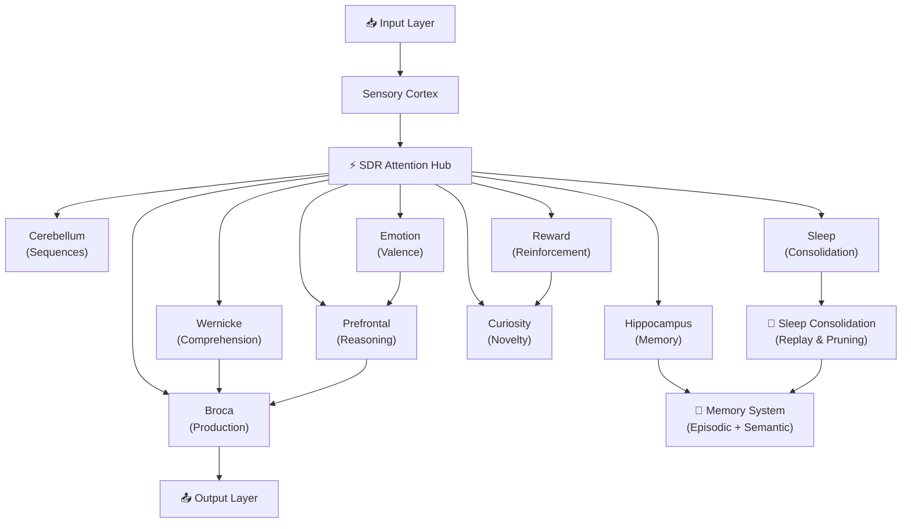

# NexusCortex

[](https://github.com/office233/Nexuscortex/actions/workflows/ci.yml)

Experimental sparse cognitive architecture written in Go.

NexusCortex is a research and learning project exploring whether ideas from Sparse Distributed Representations, associative memory, online learning, sparse routing, and local-first compute can be combined into a small cognitive-system prototype.

This is not a replacement for frontier LLMs. It is not an AGI claim. The goal is to understand and implement low-level AI system primitives from scratch.

<p align="center">
  
  
  
  
</p>

<p align="center">
  <a href="#what-it-implements">What It Implements</a> •
  <a href="#architecture">Architecture</a> •
  <a href="#quick-start">Quick Start</a> •
  <a href="#neural-dashboard">Dashboard</a> •
  <a href="#benchmark-performance-local-vs-own-dense-baseline">Benchmarks</a> •
  <a href="#roadmap">Roadmap</a>
</p>

---

## What It Implements

- **SDR-based attention** — popcount similarity and top-K retrieval (`sdr_attention.go`)
- **Sparse ternary compute** — RGBA32 packed weights, 0.25 bytes/param (`neurotexture.go`, `ternary.go`)
- **10 neural region modules** — Wernicke, Broca, Hippocampus, Prefrontal, Cerebellum, Emotion, Curiosity, Sleep, Sensory, Reward
- **Episodic and semantic memory** — storage and retrieval prototypes (`hippocampus.go`)
- **Online learning** — continuous learning without full retraining
- **Sleep consolidation** — replay-inspired episodic → semantic memory transfer (`sleep_consolidation.go`)
- **Fractal architecture** — multi-block expert routing (`fractal_cortex.go`)
- **Thousand Brains Theory** — Jeff Hawkins-inspired implementation (`thousand_brains.go`)
- **Local dashboard** — web UI for inspecting runtime state, emotional compass, cognitive vitals
- **CUDA compute backend** — optional GPU acceleration for sparse forward passes
- **Go tests** — 137 tests + 3 fuzz smoke tests, `go vet`, `staticcheck`, `gosec`, `govulncheck`

---

## Why I Built It

I wanted to learn what sits below API-level AI development: memory, retrieval, sparse representations, inference loops, state, routing, and performance constraints.

Instead of only calling model APIs, I built experimental components from scratch to understand how these mechanisms behave.

---

## System Overview



---

## Architecture

### Neural Regions

| Module | Inspired By | What It Does |
|--------|-------------|--------------|
| **Wernicke** | Wernicke's area | Language comprehension — encodes input into sparse representations |
| **Broca** | Broca's area | Language production — generates output from neural activity |
| **Hippocampus** | Hippocampus | Episodic & semantic memory formation, storage, retrieval |
| **Prefrontal** | Prefrontal cortex | Reasoning, decision-making, reservoir computing |
| **Cerebellum** | Cerebellum | Motor planning and sequence coordination |
| **Emotion** | Limbic system | Valence-arousal emotional state modulation |
| **Curiosity** | Dopaminergic system | Novelty detection, exploration drive |
| **Sleep** | Sleep cycles | Memory consolidation, synaptic pruning, replay |
| **Sensory** | Sensory cortex | Input encoding and signal processing |
| **Reward** | Reward circuits | Reinforcement learning signals |

### Project Structure

```
Nexuscortex/
├── cmd/
│   ├── cortex/              # Interactive CLI
│   ├── cortex-train/        # Curriculum trainer
│   ├── cortex-eval/         # Evaluation runner
│   ├── cortex-autonomous/   # Autonomous learning loop
│   ├── cortex-web/          # Dashboard server
│   ├── cortex-tokenizer/    # Tokenizer tools
│   ├── cortex-diagnose/     # System diagnostics
│   ├── corpus-convert/      # Corpus format converter
│   └── train/               # Alternative trainer
├── cortex/                  # Core engine (all regions, compute, tests)
├── cuda/                    # CUDA kernel implementations
├── web/                     # Dashboard UI
├── data/
│   ├── corpus/              # Training corpora
│   └── evals/               # Evaluation suites
├── docs/                    # Research docs & benchmarks
└── .github/workflows/       # CI/CD pipeline
```

---

## Benchmark Performance (local, vs own dense baseline)

| Operation | Speed | Allocations |
|-----------|-------|-------------|
| RadioNeuron Pack | **0.24 ns/op** | 0 allocs |
| RadioBus Emit (256 channels) | **1.65 ns/op** | 0 allocs |
| RadioCortex 100K neurons/tick | **1.18 ms** | 0 allocs |
| RadioCortex 1M neurons/tick | **11.8 ms** | 0 allocs |
| ForwardSparse vs Dense | **26.3× faster** | — |
| ForwardQuantum vs Dense | **73.9× faster** | — |
| NeuroRadioCortex 100K tiles/tick | **15.2 ms** | 0 allocs |

---

## Research Foundations

| Theory | Implementation |
|--------|---------------|
| **Sparse Distributed Representations** (Numenta) | `sdr.go`, `sdr_fast.go`, `sdr_pool.go` |
| **Thousand Brains Theory** (Jeff Hawkins) | `thousand_brains.go` |
| **BitNet b1.58** (ternary weights) | `ternary.go`, `neurotexture.go` |
| **Mixture of Experts** (Switch Transformer) | `fractal_cortex.go`, `expert_shard.go` |
| **Global Workspace Theory** (Baars) | `workspace.go` |
| **Predictive Coding** | `predictor.go`, `confidence.go` |
| **Hebbian/STDP Learning** | `error_learning.go`, `reward.go` |
| **Memory Consolidation** (sleep replay) | `sleep_consolidation.go` |
| **Hyperdimensional Computing** | `sdr_attention.go` |

---

## Test Results

```
ok   nexus-cortex/cmd/cortex       1.3s    ✅
ok   nexus-cortex/cmd/cortex-web   9.5s    ✅
ok   nexus-cortex/cortex          86.3s    ✅  (137 tests + 3 fuzz tests)
```

---

## Current Limitations

- **Language generation is not comparable to modern LLMs.** This is a sparse-compute prototype, not a language model.
- **Benchmarks are local** and should be treated as directional until independently reproduced.
- **Some modules are experimental** and need stronger evaluation and ablation testing.
- **Several architecture ideas are exploratory, not proven** — the neuroscience-inspired design is speculative.
- **This project is useful as an AI systems learning/research prototype**, not as a production model.

---

## Best Code Entry Points

If you want to explore the codebase, start here:

| File | What It Shows |
|------|---------------|
| `cortex/sdr_attention.go` | SDR attention and scratch-buffer optimization |
| `cortex/hippocampus.go` | Memory storage and retrieval experiments |
| `cortex/fractal_cortex.go` | Sparse/expert routing experiments |
| `cortex/sleep_consolidation.go` | Memory consolidation via replay |
| `.github/workflows/ci.yml` | Validation pipeline (test, vet, fuzz, security) |

---

## Tech Stack

| Layer | What |
|-------|------|
| **Language** | Go 1.21+ |
| **Compute** | CPU-first, optional CUDA kernels |
| **Weight format** | RGBA32 ternary tiles (0.25 bytes/param) |
| **Storage** | JSON persistence + NTX1 binary format |
| **Dashboard** | Vanilla HTML/CSS/JS |
| **CI** | GitHub Actions (`go test -race`, `go vet`, `govulncheck`, `staticcheck`, `gosec`) |
| **Dependencies** | 4 Go modules: `govaluate`, `mmap-go`, `go-webgpu`, `golang.org/x/sys` |

---

## Neural Dashboard

A local web UI for inspecting cognitive state, emotional compass, memory stats, and interacting with the system in real time.

```bash
go run ./cmd/cortex-web -port 8080 -data-dir ./data/cortex -open
```

---

## Quick Start

### Prerequisites
- Go 1.21+ (tested on 1.26)
- No other dependencies required

### Build & Run

```bash
# Clone
git clone https://github.com/office233/Nexuscortex.git
cd Nexuscortex

# Build
go build ./...

# Train on demo corpus
go run ./cmd/cortex-train \
  -data-dir ./data/cortex \
  -corpus ./data/corpus/general.jsonl \
  -epochs 15 \
  -curriculum=true \
  -revisit=true

# Run evaluation
go run ./cmd/cortex-eval -data-dir ./data/cortex

# Start dashboard
go run ./cmd/cortex-web -port 8080 -data-dir ./data/cortex -open
```

---

## Roadmap

- [x] 10 neural regions with sparse compute
- [x] Curriculum training with surprise-based replay
- [x] Sleep consolidation
- [x] Neural Dashboard
- [x] Autonomous learning loop
- [x] CUDA compute backend
- [x] 137 unit tests + 3 fuzz tests
- [x] CI/CD pipeline
- [ ] NTX binary checkpoint format (mmap-friendly)
- [ ] Expert Atlas with disk-backed experts
- [ ] Top-K expert routing
- [ ] Improved language generator (Broca 2.0)
- [ ] BPE tokenizer (32K vocab)
- [ ] Benchmark arena (1000+ test cases)
- [ ] WebGPU compute backend

---

## FAQ

**Why Go?**
Speed, simplicity, easy concurrency, single binary output, no dependency hell. Go compiles the entire project in 5 seconds.

**Do I need a GPU?**
No. CPU-first design. CUDA is optional and only accelerates sparse ternary forward passes.

**How many parameters?**
~500M with a single cortex block. Scales with FractalCortex blocks.

---

## License

GNU Affero General Public License v3.0 (AGPL-3.0) - see the [LICENSE](LICENSE) file for details.

---

<p align="center">
  ⭐ Star this repo if you're interested in low-level AI systems and sparse compute.
</p>
